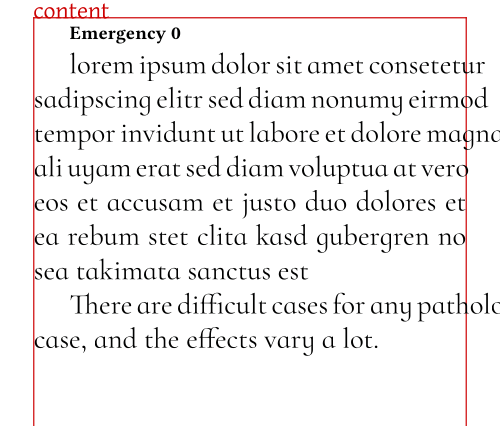

# Design notes: Automated tracking in _sile·nt_

WIP ROUGH NOTES

**Keywords:** Microtypography, tracking, compression, expansion.

Tracking (fr. "crénage elastique") is the process of adjusting the spacing between characters in a word.

It's a microtypography feature consider as a form of "letterspacing".
 - The tracking can be positive (expansion) or negative (compression).
 - Not to confuse with kerning, which is the adjustment of space between two specific characters in a font.
 - Not to confuse with interword spacing.

Robert Bringhurst suggests about 3% expansion or contraction of intercharacter spacing and about 2% expansion or contraction of glyphs as the largest permissible deviations
See Bringhurst, Robert (2008), The Elements of Typographic Style, Hartley & Marks.

Note: font contracting or expanding with variable fonts is another complementary aspect of tracking.

## Preliminary notes on line breaking

As for TeX, SILE relies on the Knuth-Plass algorithm for line breaking.

The considered content, to keep it simple again, is a sequence of:
 - fixed-width boxes (usually, bits of words, in terms of SILE, "shaped nnodes")
 - variable-width (stretchable or shrinkable) elements: glues (usually, interword spaces) or kerns (non-breaking spaces)
 - hyphenation points (also called discretionary nodes) usually obtained the Liang algorithm.

Without entering the details, the _tolerance_ value is used in rating the quality of the line breaks (or the "badness" of the resulting line).

It its usual implementation, the line breaking algorithm is invoked for up to three passes:

1. (When the pretolerance is set) a first pass with a "pretolerance" (default 100), and no hyphenation enabled.
2. A second pass with a "tolerance" (normally higher than the pretolerance, TeX uses 200 but for some reason SILE uses 500 by default...), and hyphenation enabled;
3. (When the emergency stretching setting is defined) a third pass with a the "tolerance", hyphenation enabled, and emergency stretching enabled.

In the end, the paragraph is broken into lines, which are slices of the original content.

Each line has some stretchability/shrinkability.

When considering justification (to keep it simple again), the resulting line "ratio" is the needed expansion or contraction ratio of variable-width elements, compared to the original content.

Possible outcomes:
 - ratio < -1 = variable elements cannot be compressed within the constraints enough to fit the line. The ratio is capped to -1, and the line is overfull (exceeding the right margin).
 - ratio -1..0 = variable elements will be compressed up to their minimum size within the constraints
 - ratio 0..1 = variable elements will be expanded up to their maximum size within the constraints
 - ratio > 1 = If the ratio was capped to 1, the line is underfull (not reaching the right margin) as the variable elements cannot be expanded enough to fit the line. SILE does not cap the ratio to 1 (which is good), so the variable elements will be expanded up to their maximum size beyond the constraints.

Without emergency stretching, some lines can be overfull, but not underfull, i.e. if the contraints are not met, some lines will exceed the right margin.

With emergency stretching, some lines can be underfull, but since the ratio is not capped, the line is stretched beyond the maximal size allowed by the constraints (that's the effect of the emergency stretching), i.e. have huge interword spaces.

(Well even without emergency stretching, some lines can be slightly underfull,)

The most problematic case is overfull lines, and the usual solution is a combination of several techniques:
 - Add hyphenation points if feasible
 - Increase the emergency stretching
 - Increase the tolerance

The last two options are hard to tune, and one can still get overfull lines in pathological cases, or very stretched lines.

Dynamic automated tracking can be used to:
 - Shrink the line (negative tracking or compression) if overfull, i.e. ratio < -1
 - Expand the line (positive tracking or expansion) if underfull, i.e. ratio > 1

## Specific cases to address

 - Ligatures: expansion would require them to be disabled.
 - Discretionary nodes (replacement, pre-break, post-break)

## References

Didier Verna, "L’algorithme de Knuth-Plass", exposé mensuel de GUTenberg #TeXLaTeX, 11 janvier 2024.
https://www.youtube.com/watch?v=48JNXcaKj2A

Donald E. Knuth & Michael F. Plass, "Breaking Paragraphs into Lines"
Software-Practice and Experience, vol. 11 pp. 1119-1184, 1981.

Donald E. Knuth, "TeX: The Program", Computers & Typesetting, vol. B, Addison-Wesley, 1986.
