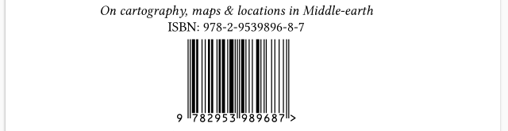

# An overview of Djot extensions and interpretations in _re·sil·ient_

_Going on an adventure with re·sil·ient #2_

Authored 02/12/2025 (aligned with _re·sil·ient_ v3.x), revised 13/12/2025 (some insights on v4.x plans)

In our series of "Going on an Adventure", we'll explore below the Djot syntax extensions and specific interpretations of [Djot](https://djot.net/) constructs implemented in _[re·sil·ient](https://github.com/Omikhleia/resilient.sile),_ our collection of [SILE](https://sile-typesetter.org/) add-on modules.

The _Markdown and Djot to PDF with SILE — User Guide_ document describes how to use the Djot lightweight markup as a native source format for _re·sil·ient_ and the SILE typesetting system.
It does cover syntax extensions and specific interpretations of Djot constructs in _re·sil·ient._
However,

- It is a PDF document, not as easily consultable as a web page for quick reference;
- It covers many other topics, being intended as a general user guide for authors also possibly discovering Djot, _re·sil·ient,_ and SILE at the same time.

This document focuses specifically on Djot syntax extensions and interpretations in _re·sil·ient,_, in a more focused way.

The target audience is therefore more technical, and the document is oriented towards people already familiar with "standard" Djot (at the time of writing; Djot being a work in progress). By "standard", we mean version 0.2.x (as supported by the `djot.lua` reference implementation). The Typescript reference implementation (`djot.js`) is (again at the time of writing) at version 0.3.x, but this has little impact on the topics discussed here.

We are well aware that extensions beyond any "standard" are always a delicate matter, as they may lead to fragmentation of the ecosystem, with different implementations supporting different sets of extensions. This is what happened with Markdown, and its many "flavors" over the years.

Nevertheless, these extensions and interpretations are the result of **practical needs** encountered while developing _re·sil·ient_ and its book class, over the last few years, composing a few documents and published books with it, and trying to solve actual typesetting problems while keeping a "lightweight" markup approach.
Therefore, they are shared for documentation purposes, but also to help other Djot enthusiasts interested in similar features, as challenges faced by _re·sil·ient_ and how they were addressed. We hope they may be useful to others, and possibly inspire future discussions.

## Syntax extensions

This section describes the Djot syntax extensions implemented in _re·sil·ient_.

### Attribute syntax extensions

#### Conditionals

The Djot attribute syntax is extended with conditionals on symbols.

For the reminder, in standard Djot, a symbol is entered in the text flow using the syntax `:symbol:`.

Initially, it was intended for emojis, but the specification now leaves it open to other uses.
We will have more to say about that later, for now let's just assume that some symbols may be available in your document context...

Conditionals allow to render content depending on whether a symbol is defined or not.

- The `?symbol` condition renders the content only if the `symbol` is defined.
- The `!symbol` condition renders the content only if the `symbol` is not defined.

Conditions work on block and inline elements alike.
This author, however, ended up using them mostly on block elements.

In _re·sil·ient_, they only apply to user-defined symbols (defined as pseudo-footnotes) and contextual metadata symbols (set by the calling context).

Before using a symbol in the text flow (`:symbol:`), one can thus test for its existence.
Compared to a more general templating logic (that would take place outside the Djot source), it allows to express conditional rendering directly in the Djot document, respecting the structure of block and inline elements.

Here is a practical example, extracted from the default template for "end-papers" in a book (using the book class in _re·sil·ient_).

```
{custom-style="center"}
::::
{?title}
:::
_:title:_
:::

{?isbn}
:::
ISBN: :isbn:

:isbn:{custom-style=bookmatter-ean13}
:::
::::
```

In this example, a custom style is applied to center the content of a block.
Then:

- If the `title` symbol is defined, a title block is rendered, with the title text taken from the `title` symbol, and italicized.
- If the `isbn` symbol is defined, an ISBN block is rendered below, displaying the ISBN number as-is in text format, and then also rendering it as an EAN-13 barcode (via a dedicated custom style).

When both symbols are defined, one would get the following type of output.



While it only offers a very simple and basic templating capability, the adavantages, of course, are that the same Djot template file will work for documents with or without titles and ISBNs, and that the Djot structure is entirely preserved.

Here is another example, extracted from the default template for the verso page the title page in a book.
Depending on whether the `pubdate-year` and `publisher` symbols are defined, different copyright lines will be rendered.

```
{?pubdate-year ?publisher}
:::
© :pubdate-year:, :publisher:.
:::
{?pubdate-year !publisher}
:::
© :pubdate-year:.
:::
{!pubdate-year ?publisher}
:::
© :publisher:.
:::
```

It is totally acceptable to have other attributes alongside conditionals, although this author recommends to keep things simple for readability.

#### Index entries

The Djot attribute syntax is extended with a "shortcut" syntax for marking index entries.

The syntax is a compact alternative to using standard attributes for that purpose.

- `:name` marks the element as belonging to the index named `name`.
- `:name=replacement` marks the element as belonging to the index named `name`, with `replacement` as the text used by the indexer logic.

Multiple indexes can be specified by separating them with spaces, as any other Djot attribute — so any text element can be marked as belonging to several indexes at once, with possibly different replacements for each index.

Theses shortcuts can currently be used on any inline or block element.
In _re·sil·ient,_ however, they are only processed when used on inline elements, and ignored on block elements.

In _re·sil·ient,_ the shorter compact syntax is equivalent to the following "standard" attribute syntax:

- `index=name`
- `index=name indexed-name=replacement`

In other words, the shortcut syntax is just a more concise way to express the same information.
The rationale is that annotating text elements is a tedious task, and the shortcut compact syntax makes it a bit easier and semantically clearer.

Consider for instance the following example using the shortcut syntax:

```
[John Doe]{:main="Doe, John"} and Aristote{:main}
A fox{:animals} or an ox{:animals=cow}
```

It is equivalent to the following using the standard attribute syntax:

```
[John Doe]{index=main indexed-main="Doe, John"} and Aristote{index=main}
A fox{index=animals} or an ox{index=animals indexed-animals=cow}
```

Multiple indexes can be listed by separating them with spaces, as other Djot attributes.

```
[Simon's Cat]{:main :animals="cat" :genus=Felis}
[Nils Olav III]{:main :animals="penguin" :genus=Aptenodytes}
```

Or the equivalent standard attribute syntax:

```
[Simon's Cat]{index="main animals genus" indexed-animals="cat" indexed-genus=Felis}
[Nils Olav III]{index="main animals genus" indexed-animals="penguin" indexed-genus=Aptenodytes}
```

It is possible to have other attributes alongside index markup.
At this point, the order in which attributes are applied, and whether they impact the indexed terms (and not just the rendered element in the text flow) are left unspecified.

How the index entries are collected and rendered is outside the scope of this specification.
In _re·sil·ient,_ there are ways to generate indexes from the collected entries, and to customize the rendering of the indexes, but these are implementation details not covered here. For details, refer to _The re·sil·ient collection of classes & packages for SILE — User Guide_ document.

### Inline element syntax extensions

#### Citations

The Djot inline syntax is extended with a citation syntax.

It allows to reference bibliographic entries in the text flow, by their unique keys, and an optional locator.

The supported syntax is a simplified subset of the Pandoc citation syntax.

A citation element starts with `[@` and ends with `]`.

In that element, multiple citations can be grouped together, separated by semicolons.
Each citation can optionally include a locator after the key, separated by a comma (or spaces).
The locator consists of a name and a value, separated by spaces.

In _re·sil·ient_, locators must match CSL locator types, or some usual abbreviations (with or without trailing dot) for convenience.

Here are some examples of valid citation syntax.

- `[@doe2020]` is a citation to the bibliographic entry with key `doe2020`.
- `[@doe2020, chapter 5]` is the same citation, with a chapter locator.
- `[@doe2020 chap. 5; @smith2019, chap. 3]` is a grouped citation to two entries, `doe2020` and `smith2019`, both with chapter locators, using an abbreviation for that locator.

How the bibliography references are provided to the document, and how the citations are rendered, is outside the scope of this specification.
In _re·sil·ient,_ there are ways to declare bibliography files (e.g. in BibLaTeX-like format), and rendering rules (e.g. according to some Citation Style Language (CSL) style), but these are implementation details not covered here. For details, refer to _The re·sil·ient collection of classes & packages for SILE; User Guide_ document.

The rationale for using a naive simplified citation syntax derives from the fact that CSL 1.0.2 does not really address in a clear way prefixes and additional suffixes for citations (not to say multiple locators per citation), or author suppression, etc.
The supported syntax in _re·sil·ient_ is therefore limited to basic citations with optional locators, as described above.

### Block element syntax extensions

#### Generalization of captions

The Djot syntax is extended to allow legends on any block element, with the same syntax as for tables.

For the reminder, in standard Djot, captions are only supported for tables, and ignored on other block elements.

```
| Header 1 | Header 2 |
|:--------:|:--------:|
| Cell 1   | Cell 2   |
^ This is a standard table caption.
```

In _re·sil·ient_, captions on other blocks are interpreted in several ways.

On a block quote, the block is rendered as an epigraph (in a broad sense), with the caption content used as its "source".

```
> The Library is a sphere whose exact centre is any one of its
> hexagons and whose circumference is inaccessible.
^ Jorge Luis Borges{.smallcaps}, "The Library of Babel"
```


On a code block, the block is considered as a listing with a caption.

````
```lua
print("Hello, world!")
```
^ A simple Lua program.
````

On a div block, the block is considered as a figure with a caption.

```
:::
Some complex figure or diagram here.
:::
^ A figure caption.
```

This is especially interesting when the figure contains several elements, or rendered code blocks (such as diagrams generated from code blocks, e.g. with Graphviz or other tools).
For a single image, the "implicit figure" interpretation discussed later might be sufficient (see below).

On other block elements, the caption is currently ignored.

Note that tables, figures and listings are sectioning elements in _re·sil·ient._
The captions are usually rendered below these elements, and depending on the style being used, they may be numbered automatically, and appear in lists of tables, figures or listings, respectively.

As div blocks can be nested, it is theoretically possible to have nested sub-figures with their own captions.
This specification does not forbid it.
The _re·sil·ient_ book class however does not currently support this feature, but it could be implemented in the future.
It's a limitation of the book class, not of the proposed Djot syntax extension itself.

## Interpretations beyond standard Djot

This section describes specific interpretations of Djot constructs in _re·sil·ient_.
These are not syntax extensions _per se,_ but rather specific ways to interpret standard Djot constructs.

### Implicit figures

For the reminder, in standard Djot, an image is encoded as follows:

```
{width="3cm"}
```

In _re·sil·ient_, by default, an image with a nonempty caption (as above), occurring alone by itself in a paragraph, is interpreted as a figure with a caption.
Otherwise, when used as an inline element surrounded by other inline content, the caption is ignored.


Pandoc users will find this behavior similar to Pandoc's "implicit figures" option.

Above, we mentioned that div blocks with captions are also interpreted as figures, as an extension of the standard Djot syntax.
So it implies, _in theory,_ that both the following syntaxes are more or less equivalent for creating a figure with a caption.

```

```

And:

```
:::

:::
^ A figure caption.
```

What we mean by "more or less equivalent" is that:

- the first syntax is simpler and more concise;
- the second syntax is more flexible, as it allows to add other content alongside the image in the figure, or apply other block-level attributes to the figure.

As mentioned earlier, figures are sectioning elements in _re·sil·ient,_ so the captions may be numbered automatically, and appear in lists of figures, depending on the style being used.

This specification does not try to clarify how captions on images are handled for images on their own paragraph, but in a captioned div block.
It's left unspecified here, but this author will note that the "implicit figure" interpretation and the actual syntax for images, being reminiscent of Markdown and Pandoc's implicit figures, might however not be perfectly aligned with the more general Djot philosophy.
While Djot improves on Markdown in several ways (incl. generalized attributes on block and inline elements), it keeeps some Markdown-isms that may not be fully consistent with the rest of the specification (like captions on tables being done in one way, and in another way for images if used as implicit figures, and not offered on other block elements in standard Djot).

### Empty internal links as cross-references

In standard Djot, an empty internal link syntax, such as `[](#some-id)`, is not forbidden, and may even generate something in the rendered output... but without text, it's not very useful!

In _re·sil·ient,_ empty internal links are interpreted as cross-references to the target element with the specified identifier, and replaced by the closest applicable numbering of that element.

For instance, if the target element is a section heading, the cross-reference will be replaced by the section number;
if the target element is a figure, the cross-reference will be replaced by the figure number; if the target element is in a footnote, the cross-reference will be replaced by the footnote number; etc.

Additional class attributes are accepted on the empty link, to tune that behavior, e.g. `[](#some-id){.page}` is resolved to the page number where the target element appears, rather than its containing number.

Standard Djot, as well as Markdown, do not provide any syntax for cross-references as found in print books (e.g. "see section 3.2 on page 45"), so this ad-hoc interpretation fills a practical need for authors, without introducing new syntax.

### Symbols as a generic leaf-extension mechanism

As noted earlier, in standard Djot, symbols are entered in the text flow using the syntax `:symbol:` but their use is not further specified.

In _re·sil·ient_, symbols are used as a generic leaf-extension mechanism.
They come in different flavors:

- Predefined symbols;
- Programmatically-registered symbols;
- Metadata-originated symbols;
- User-defined symbols.

Some precedence rules apply here: user-defined > metadata-originated > programmatically-registered > predefined.

#### Predefined symbols

The _res·sil·ient_ implementation comes with a set of predefined symbols: `:U+xxxx:` is interpreted as a Unicode character, where `xxxx` is a hexadecimal value in upper case.
For instance, `:U+2122:` gives the trademark symbol (™).

It's a "convenience" feature, since users could as well enter Unicode characters directly in the source text, but it may be useful in some contexts, esp. for characters not easily typable on a keyboard, or not easily available on your system (and/or text editor).

#### Programmatically-registered symbols

Programmatically registering symbols can be declared via a Lua API provided by the SILE component implementing Djot support.

The _re·sil·ient_ book class, typically, registers a set of symbols, significant for book authoring.

- `:_TABLEOFCONTENTS_:` (or `:_TOC_:` for short) inserts a table of contents (regular style).
- `:_FANCYTOC_:` inserts a table of contents with a fancy style (two-levels, with curly braces).
- `:_LISTOFFIGURES_:` inserts a list of figures.
- `:_LISTOFTABLES_:` inserts a list of tables.
- `:_LISTOFLISTINGS_:` inserts a list of listings.
- `:_BIBLIOGRAPHY_:` inserts a bibliography (by default, of cited works).
- `:_INDEX_:` inserts an index (by default, the "main" index).

Each of these symbols must stand alone in its own paragraph, and is rejected with an error if used inline with other content.
They all accept optional attributes to customize their rendering, but most of these are specific to the underlying implementation and its capabilities, and not covered here (e.g. the depth of a table of contents, and other settings of that nature).

Well, `:_INDEX_:` at least may be presented, as it doesn't depend as much on the underlying implementation as the other symbols do.

By default, it will insert the "main" index.
When using multiple indexes, you can specify which index to insert, either with a "standard" attribute or the same compact syntax as for marking index entries (see above).

For instance:

- `:_INDEX_{index=animals}` inserts the "animals" index.
- `:_INDEX_{:animals}` does the same, in the extended shortcut syntax.

Note that the attributes are declared on the same line, i.e. as "inline" attributes in a way.
Block attributes before these symbols apply to the containing implicit block.

Other rules may apply (such as the bibliography of cited works being cleared after its insertion, so the subsequent content starts afresh), but this document focussed on the syntax aspects, not the implementation details.

N.B. For users familiar with the (La)TeX world, please note that in _re·sil·ient,_ these constructs do not insert any type of heading or title.
If you want a heading line for your table of contents (etc.), just add it manually using the appropriate heading level or styled element in your Djot source.

#### Metadata-originated symbols

The _re·sil·ient_ implementation allows some symbols to be set by the calling context, allowing to inject contextual metadata in the text flow.

For instance, the `:title:` symbol may be set to the document title, the `:author:` symbol to the document author, etc.

These symbols can then be used in the text flow, without having to hardcode these values in the Djot source.

How these metadata-originated symbols are set is outside the scope of this specification. Eventually some metadata declaration syntax might be added to Djot, but the topic is a matter of debate, and not addressed here. In the case of _re·sil·ient,_ the metadata are usually defined in a "master document" outside the Djot source(s).

#### User-defined symbols & variable substitutions

Finally, _re·sil·ient_ allows user-defined symbols, defined as follows in the source document.

```
[^:symbol:]: Any content, block or inline.
```

It's not really a syntax extension, since it uses standard Djot footnote syntax, but repurposes it for defining symbols when the above syntax is used.

When the symbol is used in the text flow (`:symbol:`), the associated content is rendered in place, with appropriate rendering (or error handling) depending on whether the substitution content is block or inline.

One could regard this way to define custom symbols as "pseudo-footnotes" as some sort of hack, or as a clever reuse of existing syntax with an additional level of namespacing.

This specification does not even forbid the use of the "pseudo-footnote" syntax for actual footnotes (that is, called from the text flow using the standard Djot footnote syntax, as in `... some content[^:footnote:] ...`), though whether it's a good idea or not is another matter.

Here is an example of defining and using a user-defined symbol.

```
[^:pumpernickel:]: Herbert J.\ G. _"Froggie"_ Pumpernickel{.smallcaps}
```

Then one can use the `:pumpernickel:` symbol in the text flow, and it will be replaced by the defined content.
For cumbersome but often repeated content, it can be a real time-saver, helping to ensure consistency.

Since such user-defined symbols can contain arbitrary Djot content, they can even refer to other symbols.
Thus, it adds some sort of templating with recursive variable substitution to Djot, which may be useful in some contexts (though one should be careful to avoid infinite recursion).

## Additional clarifications & specificities

The elements described in this section are not syntax extensions, and not really specific interpretations of the standard either, but rather clarifications and generalizations of existing Djot constructs in _re·sil·ient._

Knowning these points can be useful when round-tripping documents between different formats (e.g. betwween Djot and Markdown), or exchanging documents between different Djot implementations.

### Styling

#### Styling equivalences

In _re·sil·ient,_ some Djot inline constructs have strictly equivalent ways to be expressed, with various degrees of syntactic sugar.

| Djot syntax | Description   | Equivalent attribute syntax in _re·sil·ient_ | Equivalent interpretation in _re·sil·ient_ |
| ----------- | ------------- | -------------------------------------------- | ------------------------------------------ |
| `{+text+}`  | Insertion     | `[text]{.inserted}`                          | `[text]{custom-style="md-insertion"}`      |
| `{-text-}`  | Deletion      | `[text]{.deleted}`                           | `[text]{custom-style="md-deletion"}`       |
| `{=text=}`  | Highlight     | `[text]{.mark}`                              | `[text]{custom-style="md-mark"}`           |
| N.A.        | Underline     | `[text]{.underline}`                         | `[text]{custom-style="md-underline"}`      |
| N.A.        | Strikethrough | `[text]{.strike}`                            | `[text]{custom-style="md-strikethrough"}`  |

Semantically, insertions and deletions are not necessarily the same as underlines and strikethroughs.
Depending on the context (e.g. academic editing, critical apparatus, etc.), they may be rendered quite differently.

In _res·sil·ient,_ moreover, all these constructs eventually rely on styles, which come with default settings but can be defined and customized at will by the user (in terms of colors, line styles, filling patterns, etc.).

#### Small capitals

The _re·sil·ient_ implementation supports a few other "pseudo-classes" which do not have to be documented here in full detail.
But one at least is worth mentioning here for its practical usefulness.

Small caps are often used in book authoring.
Using a custom-style construct is possible, and the _re·sil·ient_ styling paradigm allows to define such styles, but having a dedicated syntax makes it easier and clearer to use: `[text]{.smallcaps}`.

One could expect Djot to eventually specify a shortcut syntax for small caps... But as of now, no consensus has emerged on what that syntax should be (and it's not easy to think of anything that would remain intuitive).

### Language attribute & smart quotes

In _re·sil·ient,_ the `lang` attribute on inline and block elements is interpreted as setting the language for that element and its content.

The "smart" quotes in Djot are interpreted according to the specified language.
In other words, straight quote marks are converted to language-appropriate opening and closing quotation marks.

For most languages, paired `"` and `'` are interpreted as mapping to the primary and secondary quotations marks, respectively.

For instance, take `"..."` and `'...'`:
 - In US English, they become “...” and ‘...’
 - In German, they become „...“ and ‚...‘
 - In French (France), « ... » (with appropriate non-breaking spaces) and “like this”
 - In Russian, «...» and „...“
 - And so on for other (supported) languages.

Note that some languages use them the other way round for primary and secondary quotation marks.
UK English, Scottish Gaelic etc. use ‘...’ and “...” as primary and secondary quotation marks, respectively.
In that case, the user's input is respected, so that `"..."` and `'...'` still become and “...” and ‘...’.
In other words, paired `"` and `'` are replaced by the primary and secondary quotation marks for most languages, or by the secondary and primary quotation marks for languages where that is the convention.

Also note that some languages (as French and Russian in the examples above) use _double_ marks for secondary quotations.
In other words, the smart substitution of `'` is not necessarily a _single_ quotation mark.

Finally, note that other language-specific typographic rules are applied by the underlying typesetting engine, SILE, as appropriate — but that's beyond the point discussed here.
How the global default document language is set is outside the scope of this document. (In _re·sil·ient,_ it's usually set in the master document outside the Djot source.)

## Future extensions and proposals

These are being considered for future versions of _re·sil·ient,_ but not yet implemented at the time of writing.

They are mentioned here for documentation purposes, without commitment to follow through with these preliminary proposals.

### Secondary captions

In standard Djot, captions are limited to a single line.

It could be useful to allow multi-line "long" captions, for tables, figures, listings, and other block elements supporting captions.
In books, long captions are not uncommon, and often obey different rules than the main caption line.
As noted, the latter may be numbered automatically, and appear in lists of tables, figures or listings, while the long caption is just additional information displayed below the main caption line, sometimes with a distinct style.

Whether to use a specific syntax for that purpose (e.g. `^^` as a secondary caption marker), or to allow multiple caption lines (e.g. with the current parser, multiple `^` lines after a block), is still an open question.

### Line-obeying blocks & poetry

When dealing with poetry, this author had to used transcluded Markdown (which _re·sil·ient_ also supports via annotated code blocks) to get proper line breaks, stanzas, etc. — then relying on Markdown's extended "line block" syntax.

A few other approaches were considered.
 - Using explicit Djot line breaks (`\`) at the end of each line. Though it makes the intent clear, it quickly becomes tedious to write, error-prone
 and not very readable in the source. The renderer would also have to split verses at "hard break" nodes, and re-structure the content accordingly.
 - Using Djot div blocks with some specific class attribute. The rendererer also has to split verses on "soft line" nodes, re-structuring the content accordingly. Moreover, the semantics becomes a bit fuzzy, without a clear distinction between "line-obeying" blocks and regular div blocks.

It is felt that Djot could benefit from a dedicated block-level syntax for switching to "line-obeying" mode, for poetry and other similar constructs.

A strategy could be to introduce a specific block-level marker, say `~~|` to start and end a line-obeying block (and either the same closing marker, or the symmetrical `|~~`, or plain `~~`).

This syntax might be generalized to support other types line/space-preserving blocks:
 - `~~~` is already supported (so not clearly documented) as an alternative code block marker (preserving line breaks, spaces, etc., — but also without any markup processing inside the code block).
 - `~~|` could be used for line-obeying blocks as proposed above.
 - `~~/` could be used for space-preserving and line-obeying blocks (i.e. combining the features of code blocks and line-obeying blocks, but still processing markup inside).

Examples:

```
~~|
First verse first stanza.
Second line first stanza.

First line stanza.[^note]
Last line second stanza.
~~~
```

```
~~/
Typesetter line input
  Preserving    spaces
    And line breaks
  But still processing *markup*.
~~~
```


### Document-level metadata declaration syntax

Standard Djot does not provide any syntax for declaring document-level metadata.
The topic has been much debated, without any consensus emerging so far.

In _re·sil·ient,_ for complex book projects, document-level metadata are usually defined in a "master document" outside the Djot source.

However, having a way to declare such metadata directly in the Djot source could be useful in some contexts, e.g. for a one-file self-contained document.

The general idea is to allow special blocks at the start of the document:

```
+++ FORMAT IDENTIFIER
metadata declarations
(in some format, and respecting some identified schema)
+++
```

In _re·sil·ient,_ it could accept a subset of the "master document" format (more or less everything but the content inclusion directives).
Here is an example (not exhautive) of what such a metadata block could look like.

```
+++ application/yaml urn:example:omikhleia:resilient:document:v1
metadata:
  title: Djot extensions and interpretations in re·sil·ient
  subtitle: Going on an adventure with re·sil·ient #2
  keywords:
    - Djot
    - Markup
  publisher: Omikhleia
  pubdate: 2025-12-02
  url: https://github.com/Omikhleia/resilient.sile
font:
  family: Libertinus Serif
  size: 10pt
language: en-US
bibliography:
  style: chicago-author-date
  files:
    - typography.bib
sile:
  options:
    papersize: a5
    layout: isophi
    resolution: 300
  settings:
    textsubsuper.fake: true
    typesetter.italicCorrection: true
+++
```

The content section of a "master document" in _re·sil·ient_ lists the source files (Djot, Markdown, SIL, XML, etc.) to be included in the document, in a hierarchical way.
While not applicable here for a standalone Djot self-contained document, some of its features may have to be considered:

 - Parsing options -- We have none at the moment for Djot, but this might change in the future for compatibility with other set of extensions, as with Markdown, where one can enable or disable some (Pandoc-style) features, to acccomodate different "flavors".
 - Header shifting (i.e. how heading levels are adjusted when including a document) -- In a master document, the hierarchical structure dictates how heading levels are automatically shifted when including a document; for a standalone document, some way to specify that might be useful so a document can be re-used in different contexts without having to edit its heading levels manually.

The other way round, to allow the smooth inclusion of standalone documents with their embedded metadata in a larger master document, the specification would also have to clarify how metadata declared in the standalone document interact with elements declared in the master document.
Some (e.g. fonts, bibliobraphy style, etc.) may be overridden by the master document.
Others (e.g. bibliography files) may have to be merged.
Somr (e.g. title, author, etc.) may have to be scoped to the included document only (for metadata-originated symbols), and overridden by the master document in the global context.
Finally, a few (e.g. language) may imply the implicit addition of div blocks with appropriate attributes around the content of the included document.
