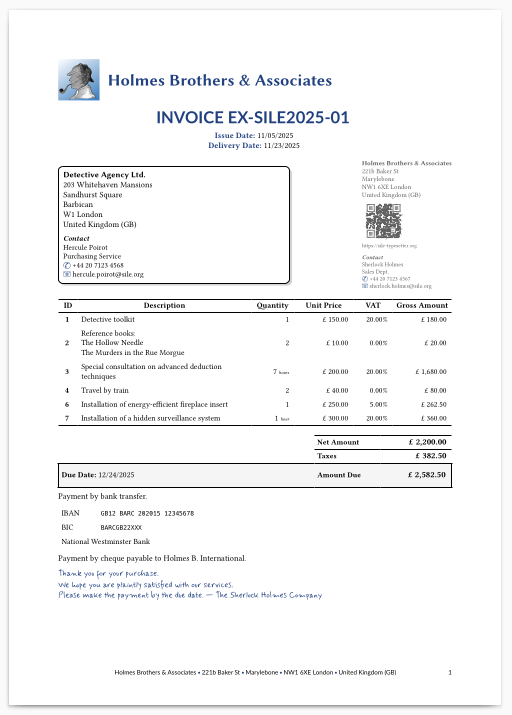

# Making Factur-X/ZUGFeRD invoices with SILE

_(Going on an adventure with re·sil·ient #1)_

In our series of "Going on an Adventure", we'll explore below the process of creating PDF invoices compliant with the Factur-X/ZUGFeRD standard using SILE, the programmable typesetting system, and our own _re·sil·ient_ collection of SILE add-on modules.

In this document, on our way, we will use several open source tools:
 - [SILE](https://sile-typesetter.org/), the digital typesetting system,
 - The [_re·sil·ient_](https://github.com/Omikhleia/resilient.sile) collection of add-on modules for SILE,
 - [Poppler](https://poppler.freedesktop.org/) command-line utilities (to inspect and extract embedded files from a PDF),
 - [MuPDF](https://mupdf.com/core) command-line utilities (to inspect PDF structure).

## Why invoices?

Without extra tooling, traditional office suites might not really be suited for automating invoice generation.

Generating invoices with free open source tools is something that pops up from time to time on various discussion forums.

Some people even think that it's good example of the type of things a digital typesetting system should be able to do.
Here are a few existing solutions using various typesetting systems:
 - With Pandoc + LaTeX: ([1](https://github.com/mrzool/invoice-boilerplate)), ([2](https://codeberg.org/bbbhltz/Facture-Auto-Entrepreneur));
 - With Typst: ([3](https://typst.app/universe/package/invoice-maker)), ([4](https://typst.app/universe/package/tiefletter)), ([5](https://typst.app/universe/package/laskutys)),
 - Or even with Go: ([6](https://github.com/angelodlfrtr/go-invoice-generator)).

But frankly, I am not impressed. On the visual side, an invoice is just a few tables and text blocks, and it doesn't require sophisticated typography. There's no real typesetting challenge there, and there are many accounting tools that can do the job.

These are but a few random solutions, without a judgment on their capabilities (or lack thereof). But people knowing me will understand that I am not satisfied with these solutions, and like to explore further possibilities. I am not aware of any prior solution using SILE, despite its programmability and its capabilities. So let's address that gap, and jump even further.

## Why is Factur-X/ZUGFeRD important?

Factur-X 1.07.2 (also known as ZUGFeRD 2.3.2 in Germany) is one of the most widely used standards for electronic invoicing in Europe.
In September 2026, if I read that correctly, the European Union will make electronic invoicing mandatory between businesses and public administrations, and it's based on the EN 16931 standard, of which Factur-X/ZUGFeRD is an implementation.

Factur-X/ZUGFeRD invoices are hybrid invoices, meaning they combine a human-readable PDF representation with a machine-readable standardized XML representation of the invoice data.

None of the above-mentioned solutions provide Factur-X/ZUGFeRD support, at the time of writing.

Wouldn't it be great if a free open source tool like SILE could help generating such invoices?

It's more than time to explore that possibility, and go beyond a simple "visual" PDF invoice generation. As the chairman of a non-profit organization, I have a few invoices to issue from time to time. I am not really concerned by the upcoming regulations in that context, but it's a fun idea to toy with.

## Compiling a YAML-based invoice with SILE

Some of the above-mentioned solutions use an input file in YAML format to define the invoice data.
It's a good idea, as YAML is a human-friendly structured data format, easy to read and write.
(SILE has builtin support for reading XML files, but authoring an invoice in Factur-X XML directly is not really user-friendly, and error-prone.)

So I adopted the same approach, and defined my invoice data in a fairly simple YAML file, but with an additional constraint: the YAML structure must be sufficiently expressive to derive all necessary data for generating a Factur-X/ZUGFeRD compliant invoice.

I am not going to detail the YAML structure here, but you can find the example invoice YAML file, fully commented, in the _re·sil·ient_ repository, in `examples/invoice/invoice.yaml`.

Let's generate an invoice PDF using the _re·sil·ient_ collection of add-on modules for SILE.
It's as simple as running a single command.

```
$ resilient examples/invoice/invoice.yaml
```

The `resilient` command (alias) is just a wrapper around SILE to make the use of the _re·sil·ient_ collection easier.
Just for you to be sure it doesn't hide any trick, in my case, it just a fairly long `docker run` command (as I didn't install SILE on my host system, but run it from a Docker container), and the `sile` program just invoked with an additional option (for some _re·sil·ient_ components to be preloaded early). I'd use the same command whatever the type of document I compile, a book or whatever.

The generated PDF invoice is in `examples/invoice/invoice.pdf`.



## More than a pretty presentation

Besides looking nice, what's great about that PDF?

First, the PDF metadata contain a proper title and author.
You could of course check these with you favorite PDF viewer. It certainly has some "Properties" menu somewhere...
Here, we will simply use the `pdfinfo` command line tool, from the Poppler utilities.

```
$ pdfinfo examples/invoice/invoice.pdf
Title:           Invoice EX-SILE2025-01
Subject:         Invoice EX-SILE2025-01
Author:          Holmes Brothers & Associates
Producer:        SILE v0.15.13 (LuaJIT 2.1.1703358377) [Rust]
... (snipped) ...
```

But there is more!

This PDF contains embedded files. Or attachments, if you prefer to call them that way.

Some PDF viewers allow you to see and extract embedded files. Acrobat Reader, for instance, should certainly be able to do that, via some menu or panel.
I can't say, I don't use non-free software when open source alternatives exist...
Anyway, we will use again a command line tool from the Poppler utilities.


```
$ pdfdetach -list examples/invoice/invoice.pdf
3 embedded files
1: factur-x.xml
2: invoice.yaml
3: sherlock.png
```

Ahah! There are three embedded files here:
 - A Factur-X XML file,
 - The original YAML source file,
 - The seller logo image.

We can extract them all with `pdfdetach -saveall`, and check that they are indeed what we expect. Just be sure to do it in an empty directory, to avoid name overwrites.

```
$ pdfdetach -saveall examples/invoice/invoice.pdf
$ file factur-x.xml; file invoice.yaml; file sherlock.png
factur-x.xml: XML 1.0 document, Unicode text, UTF-8 text, with very long lines (8194)
invoice.yaml: Unicode text, UTF-8 text
sherlock.png: PNG image data, 334 x 334, 8-bit/color RGBA, non-interlaced
```

The inclusion of the YAML source file and the seller logo image mean than whenever you receive this invoice PDF, you can extract the original data and re-generate the invoice if needed.
This is a great way to ensure long-term accessibility of your invoices, isn't it?

> The PDF would also contain a buyer logo image, if we had declared one in our invoice.
> If you re-run the generation command a second time, a style file will also be attached to the PDF. The styling paradigm in _re·sil·ient_ won't be detailed be here, but many aspects of the invoice presentation can be customized via a simple style file, if you are not satisfied with the default presentation.

The Factur-X file is an XML document following the Factur-X 1.07.2 / ZUGFeRD 2.3.2 (EN 16931) standard for electronic invoices.
It can be extracted and processed by accounting software supporting this standard, ensuring interoperability with various systems.

With such a self-contained PDF invoice, you have the best of three worlds:
 - A human-readable and nicely formatted PDF invoice,
 - A machine-readable Factur-X XML file for automated processing,
 - The original source files for any future needs.

## Digging into the implementation

What were the necessary steps to achieve this interesting result?

 1. An "inputter" module to read our invoice data from a YAML file and prepare it for SILE,
 1. Some code to generate the Factur-X XML file from the invoice data,
 1. Some code to add proper PDF metadata (title, author, etc.) to the PDF,
 1. Some code to embed attachments in the PDF.
 1. Some code to add the relevant XMP metadata to the PDF.

Let's detail these steps.

1. First, we need SILE to accept our invoice data in YAML format.

   That's one of thet great thing about SILE: it is not tied to a specific input format.
   Right, reading its User Manual, you may had the first impression that SILE only processes its own SIL-TeXlike or SIL-XML formats.

   For everyone with a background in digital typesetting solutions, the impression is understandable. The (La)TeX world is used to having a single input format, and Typst is also going this way.

   But in fact, SILE is very modular and extensible.
   Being provided with the right "inputter" module, it can read any data format you want.

   So to get that part done, I just implemented such an **invoice** inputter module in the _re·sil·ient_ collection.
   It is responsible for reading and parsing the invoice data from a YAML file and putting everything in place for SILE to generate the PDF content.

   > This is the same syntax extension mechanism as used by my Markdown, Djot, Pandoc AST, and "master document" inputter modules, all part of the _re·sil·ient_ collection. The inputter parses the input file and generates an Abstract Syntax Tree (AST) that SILE can process to produce the final document.

1. We need to generate the Factur-X XML file from the invoice data.

   It's just a matter of creating the XML structure according to the Factur-X standard, but performing such a task in other typesetting systems is often not straightforward.

   In the (La)TeX world, it would be a nightmare to do that in pure TeX macros. Surely, there's Lua(La)TeX now, but why use sunch a convoluted system when programmability in Lua is the core "spirit" of SILE?
   As for Typst, it has much better programming capabilities than TeX, but you have to use its own scripting language. It's powerful, but why use a specialized language, specific to that engine?

   In SILE, we can use Lua, a full-fledged programming language, to implement such functionalities.

   I implemented the Factur-X generation code in pure Lua.

   > It's just a simple table (parsed representation of the YAML invoice data) to string (the XML content) conversion, not needing any SILE-specific features... So it's normally reusable in other Lua-based systems as well.

   The hardest part in its making was to understand the Factur-X "Cross Industry Invoice" (CII) XML structure and rules.

1. Addding PDF metadata is straightforward with SILE.

   We just need to invoke therelevant commands from the SILE **pdf** package. The inputter takes care of adding them to the AST, with the proper values from the invoice data.

1. The standard SILE distribution does not provide any package to embed attachments in the PDF.

   But another great thing about SILE is that almost everything is extensible. For PDF generation, SILE relies on a C-based library (**libtexpdf**), derived from the TeX ecosystem's **dvipfmx** tool.
   The library itself does not have high-level methods to embed attachments in the PDF (as far as I know), but it does provide the low-level commands that would be needed for that. These low-level commands are exposed to Lua.

   So you can see it coming, all I had to do is to implement the high-level SILE commands to embed attachments in the PDF, using these low-level PDF commands. This new package, **resilient.attachments**, is part of the _re·sil·ient_ collection (release 3.3.0).

   Then, as for the PDF metadata, the inputter module adds the relevant commands to the AST, and lo and behold, the generated PDF contains the embedded files.

 1. The PDF generated by SILE doesn't contain any XMP metadata by default.

    An XMP packet is just an XML RDF document, so we can generate it as a string in Lua, and insert it in the PDF, using the above-mentioned low-level PDF commands.
    There's a bit more to say on the topic, but we'll discuss that later, when discussing compliance to standards.

This might seem a bit involved, but in fact, it was quite straightforward and fun to implement. SILE is a great Lua-on-steroids digital typesetting system, for such tasks, and Lua is an enjoyable programming language to work with.

## Digging deeper into PDF structure

This document is not about PDF internals, but just to satisfy the curious ones, let's have a look at the PDF structure to see how these embedded files are represented.
It's also interesting for demonstrating some cool introspection tools, so we'll use the `mutool` command line tool from the MuPDF suite.

### Catalog

We can start by looking at the Catalog object, which is the root of the PDF document structure.

```
$ mutool show examples/invoice/invoice.pdf Root
1 0 obj
<<
  /Names <<
    /EmbeddedFiles 25 0 R
  >>
  /AF [ 20 0 R 22 0 R 24 0 R ]
  /Metadata 26 0 R
  /Pages 27 0 R
  /Type /Catalog
>>
endobj
```

Object references and entries may vary, but the relevant parts for us are:
 - The `/Names/EmbeddedFiles` entry
 - The `/AF` entry
 - The `/Metadata` entry

### Embedded files

```
$ mutool show examples/invoice/invoice.pdf 25
25 0 obj
<<
  /Names [ <FEFF006600610063007400750072002D0078002E0078006D006C>
      20 0 R <FEFF0069006E0076006F006900630065002E00790061006D006C>
      22 0 R <FEFF0073006800650072006C006F0063006B002E0070006E0067>
      24 0 R ]
>>
endobj
```

Three embedded file are referenced here, with their names in UTF-16 encoding (with a BOM). After all, file names in modern days may contain non-ASCII characters, so it's better to be safe and use Unicode.

### Associated files

As you can see, the object references in the `/AF` array correspond to the same embedded files as above (20, 22 and 24).

You may wonder what is the purpose of this duplication.

 - The `/Names/EmbeddedFiles` entry was introduced in PDF 1.4, and is what is used by PDF viewers to list and extract embedded files.

 - The `/AF` ("Associated Files") entry was introduced in PDF/A-3 to explicitly associate embedded files with the document content, with a semantic relationship.

PDF/A is based on PDF 1.7. In PDF/A-1 and PDF/A-2, arbitrary embedded files are forbidden, so the question does not arise. In PDF/A-3, all embedded files must be associated with the document content using the `/AF` entry.

In PDF 2.0, the `/AF` entry is part of the standard PDF specification. Theoretically, it could just be a subset of embedded files. PDF/A‑3, however, mandates that every embedded file must also be an associated file.

So what does the presence of the `/AF` entry bring in addition to the `/Names/EmbeddedFiles` entry?

Since they both point to the same objects, it must mean that PDF/A-3 mandates some additional information to be present in these objects, right? Let's have a look.

### File specifications

```
$ mutool show examples/invoice/invoice.pdf 20
20 0 obj
<<
  /Type /Filespec
  /F (attachment1.txt)
  /UF <FEFF006600610063007400750072002D0078002E0078006D006C>
  /Desc <FEFF004600610063007400750072002D005800200031002E00300037002E00320020005A00550047004600650052004400200032002E0033002E003200200045004E0031003600390033003100200069006E0076006F00690063006500200058004D004C>
  /AFRelationship /Alternative
  /EF <<
    /F 19 0 R
    /UF 19 0 R
  >>
>>
endobj
```

This is the file specification object for the `factur-x.xml` embedded file.

 - Being an associated file, it contains the additional `/AFRelationship` entry, specifying the relationship of the embedded file to the document content (Data, Source, Supplement, Alternative, Unspecified).
 - The `/Desc` entry provides a description of the file content. Here, in UTF-16 encoding, "Factur-X 1.07.2 ZUGFeRD 2.3.2 EN16931 invoice XML" — That's what our implementation put there.
 - The `/F` and `/UF` entries provide the file name in "regular" and UTF-16 encoding, respectively. The UTF-16 version reads "factur-x.xml". The "regular" version is problematic, as non-ASCII characters may not be properly represented. — Our implementation does not bother to check if the Unicode name can be represented in the regular encoding, and just put a placeholder name there. We should improve that, but it's not a big deal as PDF viewers should use the UTF-16 version if present, as per the PDF specification.
 - The `/EF` entry points to the actual embedded file stream object. Note that PDF allows to have different streams for the "regular" and UTF-16 versions of the file name, but this is rarely used in practice. Call that a convoluted design choice of the PDF format...

Obviously, the Factur-X XML file is marked as an "Alternative" (as it should). We are no going to look at the other files with as much details, but just note that the YAML source file is marked as a "Source" (since you can regenerate the same invoice from it), and the logo image(s) as a "Supplement" (as they are indeed supplementary files).

### File streams

Our Factur-X XML file specification points to object 19 for the actual embedded file stream. Let's dive into it.

```
$ mutool show examples/invoice/invoice.pdf 19
19 0 obj
<<
  /Type /EmbeddedFile
  /Subtype /application#2Fxml
  /Length 1650
  /Filter /FlateDecode
>>
stream
<?xml version="1.0" encoding="UTF-8"?><rsm:CrossIndustryInvoice xmlns:rsm="urn:
... (snipped) ...
</rsm:CrossIndustryInvoice>
endstream
endobj
```

There we are at last, the actual embedded file stream, our actual content.
 - The `/Subtype` entry encodes the MIME type of the embedded file. Here, `application/xml` (with some PDF-specific fancyness),
 - The stream content is compressed using the Flate algorithm, as indicated by the `/Filter` entry.

And the stream content is indeed the Factur-X XML file our implementation generated.

We could do the same inspection for the other two embedded files, but they would be similar. Well, probably you shouldn't do it for the PNG image file, as it would flood your terminal with nonsense, for a human reader at least!

### Metadata stream

Last but not least, let's have a look at the `/Metadata` entry in our Catalog, corresponding to the so-called XMP (Extensible Metadata Platform) packet.

```
$ mutool show examples/invoice/invoice.pdf 26
26 0 obj
<<
  /Type /Metadata
  /Subtype /XML
  /Length 736
  /Filter /FlateDecode
>>
stream
<?xpacket begin="..." id="W5M0MpCehiHzreSzNTczkc9d"?>
<x:xmpmeta xmlns:x="adobe:ns:meta/">
  <rdf:RDF xmlns:rdf="http://www.w3.org/1999/02/22-rdf-syntax-ns#"
... (snipped) ...
  </rdf:RDF>
</x:xmpmeta>
<?xpacket end="w"?>
endstream
endobj
```

It proves that the XMP packet is indeed present in our generated PDF invoice. There are some concerns to discuss regading its content, but we'll address them too when we discuss compliance to standards below.

### Preliminary conclusion

That long detour had but one main purpose, to show you how digging into PDF structure details, with the great Poppler and MuPDF utilities, is not that hard, and can help you undertand what is at stake when implementing such a feature.

It also shows how SILE's extensibility and programmability in Lua allow us to implement these features. It is quite impressive how much can be achieved with relatively little code, and an interesting, completely extensible typesetting system.

## Compliance to standards

While near to our goal, some aspects of our implementation require further attention.

### PDF/A-3 compliance

Factur-X mandates the use of PDF/A-3.

In our implementation, more precisely, we should at least aim for PDF/A-3B compliance; that is, the "basic" level of conformance, ensuring visual appearance preservation. (PDF/A-3A, for instance, would require proper "tagging" of the PDF content, a whole other level of complexity.)

I haven't yet performed a full compliance check. But some aspects need further attention:

 - XMP metadata must be present, which we do, but...
    - The stream should not be compressed. SILE's version of **libtexpdf** currently compresses all streams by default, below a certain size threshold. — There's a June 2016 fix in **dvipfmx** to enforce that rule, but (unfortunately) SILE's derived implementation is older.
    - Our XMP includes the PDF/A identification part, the list of embedded files (and for Factur-X, the expected entries as well), but misses other mandatory elements, such as the Dublin Core parts and CreateDate/ModifyDate parts. — That would require some more **libtexpdf** low-level PDF commands to be exposed to Lua, or some clever workarounds.
 - More generally, other aspects of PDF/A-3B compliance must be checked, such as color profiles, fonts embedding, etc. — SILE's quite old **libtexpdf** library may not fully comply with all PDF/A-3B requirements.

In a nutshell, our document is probably not fully compliant with PDF/A-3B requirements.

It's a big topic, but the question at stake is how far do we have to ensure compliance, for other Factur-X tools to properly accept our generated PDF invoices, and not to reject them due to some PDF/A-3B non-compliance in the details. Fractur-X itself doesn't really care about PDF/A-3B compliance, as long as the necessary associated invoice XML is present. It all depends on the target software processing these invoices, whether they are permissive or strict on that point.

### Factur-X compliance

Factur-X, on its own, is a rather complex standard, with many profiles (basic, extended, etc.) and detailed rules on top that.

As an example, take the "LanguageID" element. Initially, I included it, but when it is present, some validation tools emit a warning (for some reason, it shouldn't be there), and other validators raise an error.

I am no specialist. My understanding is limited to what I could gather from a cursory reading of the XML schemas (XSD) and some files I could find and analyze. Surely, someone with deeper knowledge of the Factur-X standard could help refining the implementation.
We should aim at compliance with Factur-X 1.07.2 / ZUGFeRD 2.3.2 (EN 16931), but I am not sure what it exactly entails in practice.

The easiest way for more konowledgeable people? Extract the Factur-X XML file from our generated PDF invoice example, and report any issues you may find when validating it with your favorite tools.

Extending our YAML structure and supporting more Factur-X features is also a possibility.

## Going further on the presentation side

Besides compliance to standards, there are other aspects to consider on the visual aspect.

I said above that the PDF (as visual representation of the invoice) looks nice, but that's a subjective opinion, and I have never been that good at design.
Surely, the invoice presentation could be improved, and customized to your own needs. Feel free to study the code (how experimental it is), and propose improvements and customizations.

Internationalization is another important aspect. Our implementation currently supports a few languages already (English, French, German, Spanish, Italian, Dutch, Portuguese, Catalan, Icelandic, Russian), but more could be added easily, and the existing ones could be improved as well. Feel free to contribute translations for your own language!

If you never used SILE before, this could also be a good opportunity to discover its capabilities! There are rough edges, but it does have some great features.
Don't get yourself stuck by using specialized niche languages and tools. Yes, Pandoc, (La)TeX and Typst users, I am looking at you! — And I do love your solutions, not denying that, but sometimes one has to challenge the apparent _status quo_, and push the boundaries further.

## Overall conclusion

In this document, we saw how to generate a PDF invoice from a YAML source file, resulting, with just one single-line command, in a PDF file with embedded Factur-X XML, and other useful attachments, including the original source files.

SILE's extensibility and programmability in Lua made it possible to implement these features with relative ease, in but a few hours of work (for a first prototype). The end-result is available as part of the _re·sil·ient_ collection of SILE add-on modules.

There are limitations to address, and improvements to be made. Yet, the core functionalities are there, and I hope potential users and contributors to SILE will help refining and enhancing this experimental implementation.

Always look up at the skies, and go on your own adventure with SILE and _re·sil·ient_!
